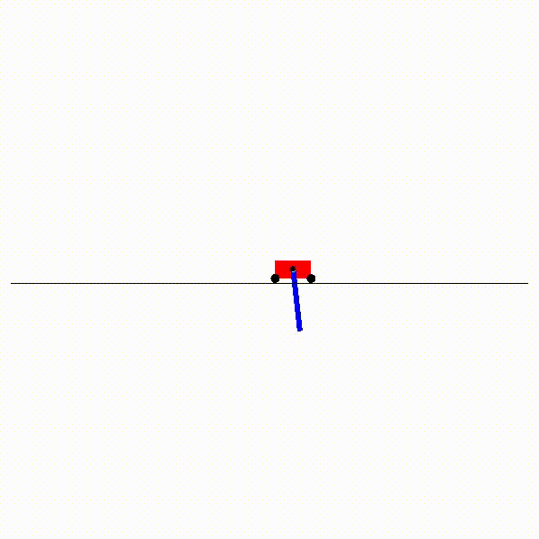

# Reproducing-WANN
Reporducing a [Weight Agnostic Neural Networks](https://weightagnostic.github.io/) paper.

## Code
Almost all of the code is based on the original repository provided by the paper authors [on GitHub](https://github.com/google/brain-tokyo-workshop/tree/master/WANNRelease).

## Report

The report can be found [here](https://github.com/DomNavi/Reproducing-WANN/blob/master/report.pdf).

## Extra

The netowork trying to learn how to swing up and balance a pole decided to fall into a local optimum. The easiest way to get score without performing anything complicated is just doing this:

