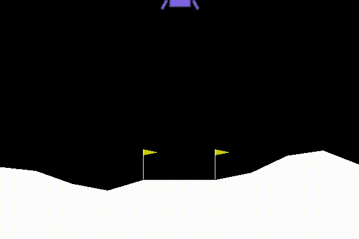
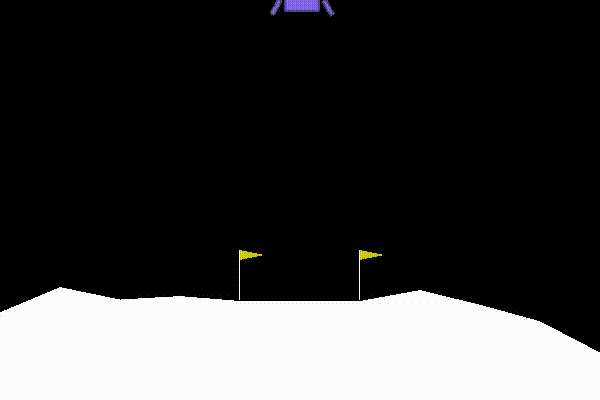

# Reproducing-WANN
Reporducing a [Weight Agnostic Neural Networks](https://weightagnostic.github.io/) paper.

## Code
Almost all of the code is based on the original repository provided by the paper authors [on GitHub](https://github.com/google/brain-tokyo-workshop/tree/master/WANNRelease).

## Report

The report can be found [here](https://github.com/DomNavi/Reproducing-WANN/blob/master/report.pdf).

## Extra

The netowork trying to learn how to swing up and balance a pole decided to fall into a local optimum. The easiest way to get score without performing anything complicated is just aimlessly spinning:

In some cases the WANN method did not work well. For example in LunarLander-v2 task the network learned to use almost any negative weight value successfully, but completely failed if the weights were positive.
 

Notice how the NN knows to turn off all of the engines straight when it arrives at the point. It looks quite impressive considering how simple the architecture is. The final architecture can be found in the paper or here, with its progress throughout generations.

