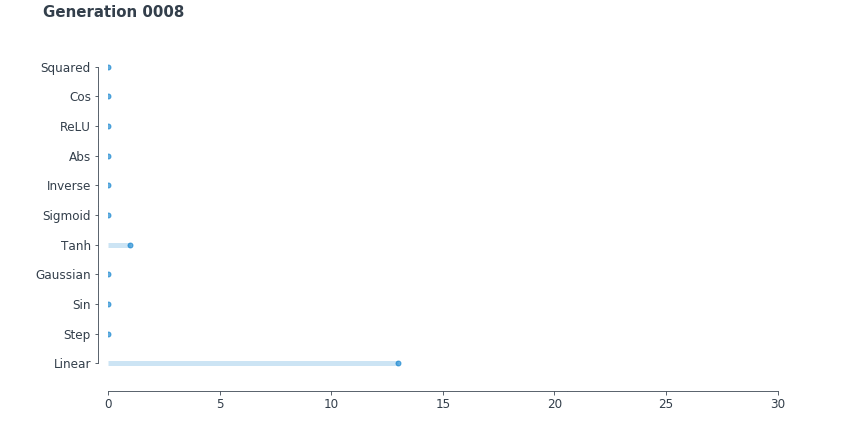

# Reproducing-WANN
Reporducing a [Weight Agnostic Neural Networks](https://weightagnostic.github.io/) paper.

## Code
Almost all of the code is based on the original repository provided by the paper authors [on GitHub](https://github.com/google/brain-tokyo-workshop/tree/master/WANNRelease).

## Report

The report can be found [here](https://github.com/DomNavi/Reproducing-WANN/blob/master/report.pdf).

## Extra

The netowork trying to learn how to swing up and balance a pole decided to fall into a local optimum. The easiest way to get score without performing anything complicated is just aimlessly spinning:

In some cases the WANN method did not work well. For example in LunarLander-v2 task the network learned to use almost any negative weight value successfully, but completely failed if the weights were positive.

Negative Shared Weight |  Positive Shared Weight
:-------------------------:|:-------------------------:
 | 

Notice how the NN knows to turn off all of the engines straight when it arrives at the point. It looks quite impressive considering how simple the architecture is. The final architecture can be found in the paper or here along with its progress throughout generations.

Also, here's some histograms showing the activation function distribution throughout generations. It seems like the paper allows for too many different activation functions which hurts interpretability, maybe it would be worth penalizing the network for such complexity.

## Additional Note
Authors of the paper made a lot of effort in one of the sections trying to analyze what certain parts of the network are doing, but did not say if the same topologies emerge when starting over and over from scratch. That would be quite an interesting thing to study.
